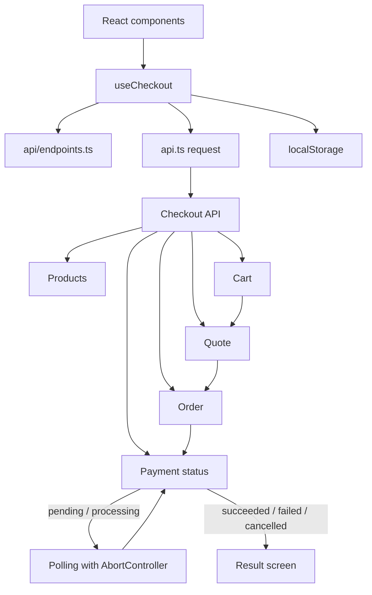

# @checkout/web

React + TypeScript приложение оформления заказа.

## Запуск

Из корня репозитория:

```bash
npm install
npm run dev -w @checkout/api
npm run dev:web
```

Фронтенд откроется на `http://localhost:5173`. Если порт занят, Vite выберет следующий свободный порт. Для production-сборки используйте `npm run build:web`.

## Архитектура

```text
src/
├── api/
│   └── endpoints.ts       # единый список API-адресов и builders с id
├── components/            # Shell, Shop, Checkout, Result
├── hooks/
│   └── useCheckout.ts     # server workflow, восстановление и polling
├── types/
│   └── checkout.ts        # типы формы, sandbox, options и session
├── utils/                 # storage, money и единое сообщение ошибки
├── api.ts                 # общий transport и разбор envelope/error
└── App.tsx                # композиция экранов
```

Все обращения проходят через `src/api.ts`: он добавляет адрес API и Authorization, сериализует JSON, разбирает envelope, пустые ответы и единый формат ошибок. Адреса не дублируются в компонентах или hook: они собраны в `src/api/endpoints.ts`.

`useCheckout` управляет серверным workflow: сессией, корзиной, quote, заказом, payment и polling. Компоненты получают типизированные данные и callbacks и отвечают только за отображение. Сервер остаётся источником истины для состава корзины, стоимости доставки, итоговой суммы и статуса заказа.



### Состояние и устойчивость

Токен сессии, идентификаторы заказа и попытки оплаты, а также idempotency keys сохраняются в `localStorage`. После перезагрузки заказ и последняя payment attempt восстанавливаются; незавершённая оплата продолжает polling. При уходе со страницы polling отменяется через `AbortController`, а stale-ответ не меняет актуальное состояние.

Создание заказа и payment используют idempotency keys. Повтор того же запроса сохраняет прежний ключ, а новая попытка оплаты после отказа или отмены получает новый. Ошибки API не очищают заполненную форму. При конфликте версии корзины данные обновляются, quote сбрасывается и оформление можно повторить.

В часто вызываемом обновлении корзины выполняется один запрос и один проход React по её позициям для рендера. Итоги и стоимость доставки не пересчитываются на клиенте и не создают промежуточных коллекций: их возвращает API. Изменение одной позиции сохраняет остальные данные сервера без локального копирования каталога.

Проверить можно успешную оплату картой, отказ и отмену с повторной попыткой, наличные, курьера, пустую корзину и перезагрузку во время ожидания оплаты. Известное ограничение: приложение не реализует offline-очередь, а при конфликте версии корзины обновляет данные и просит повторить quote.

Условия: [задание](../../docs/ASSIGNMENT.md). API: [интеграция](../../docs/INTEGRATION.md). Критерии: [EVALUATION.md](../../docs/EVALUATION.md).
